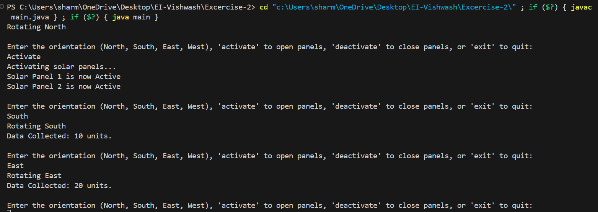

# Satellite Command System Programming Exercise

## Problem Statement
You are tasked with developing a **Satellite Command System** that simulates controlling a satellite in orbit. The satellite starts in a default initial state and can accept a series of commands to change its orientation, solar panel status, and data collection.

---

## Functional Requirements

### 1. **Initialize the Satellite**  
   Create a class or function that initializes the satellite's attributes to their initial state.

### 2. **Rotate**  
   Implement a command called `rotate` that takes a direction parameter (`North`, `South`, `East`, `West`) and sets the satellite's orientation accordingly.

   - **Example**:  
     `rotate(North)` would set the orientation to `"North"`.

### 3. **Activate/Deactivate Solar Panels**  
   Implement commands called `activatePanels` and `deactivatePanels` to control the solar panels' status.

   - **Example**:  
     `activatePanels()` would set the solar panels to `"Active"`.

### 4. **Collect Data**  
   Implement a command called `collectData` that increments the `Data Collected` attribute by 10 units, but only if the solar panels are `"Active"`.

   - **Example**:  
     `collectData()` would set the data collected to 10 if the solar panels are `"Active"`.

---

## Initial State
The satellite begins with the following attributes:

- **Orientation**: `"North"`
- **Solar Panels**: `"Inactive"`
- **Data Collected**: `0`

---

## Commands to be Executed

The series of commands should be executed in a sequential manner over the initial state, altering the satellite's state accordingly. You can execute them through function calls or simulate a command-line interface where these commands can be entered.

### **Example Commands:**

```plaintext
rotate(South)
activatePanels()
collectData()
```

--
## Executing the code

```plaintext 
javac main.java 
```  

```plaintext
java main
```




